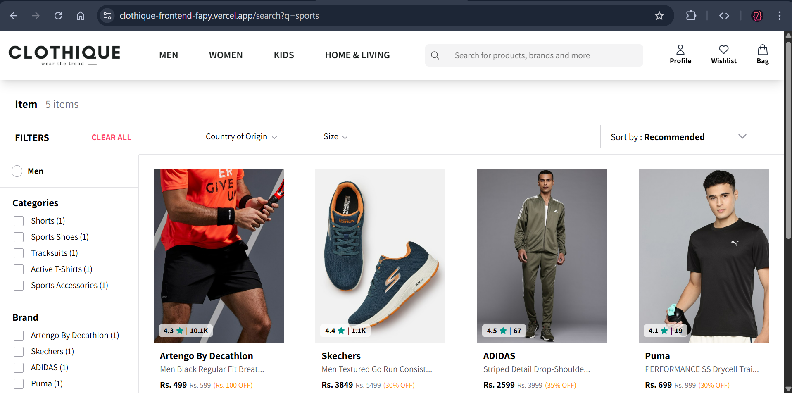
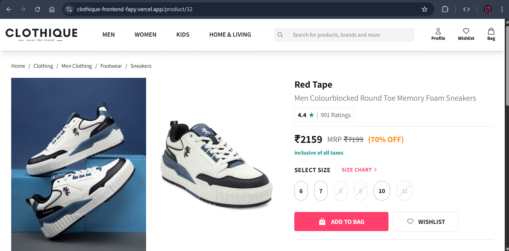
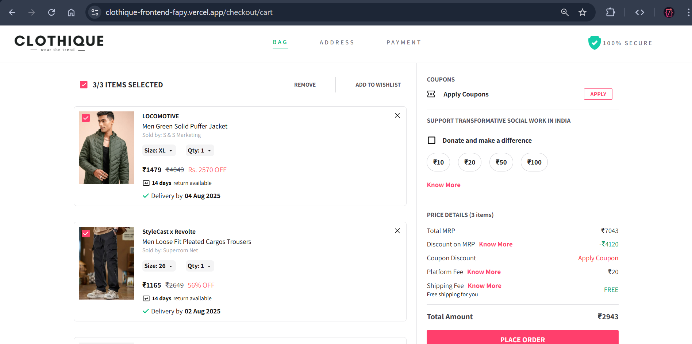
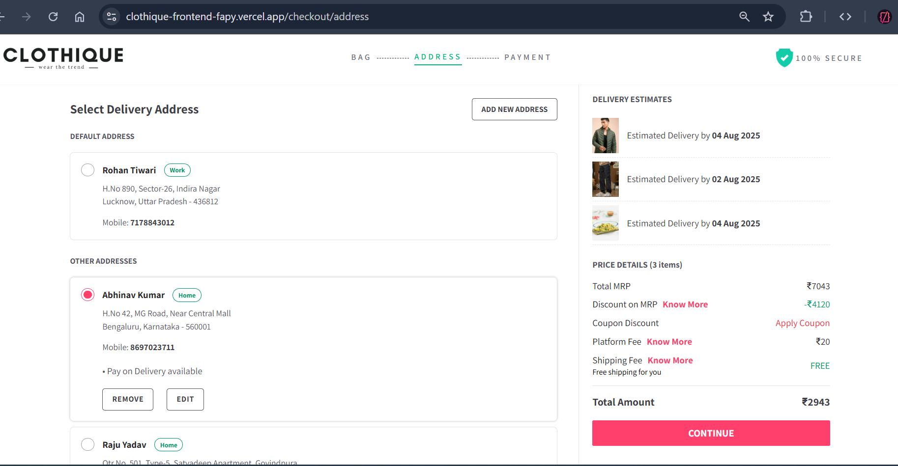
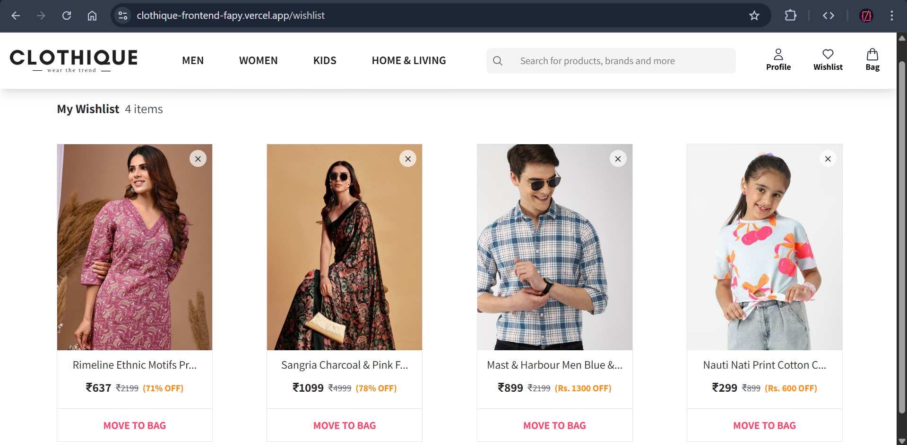
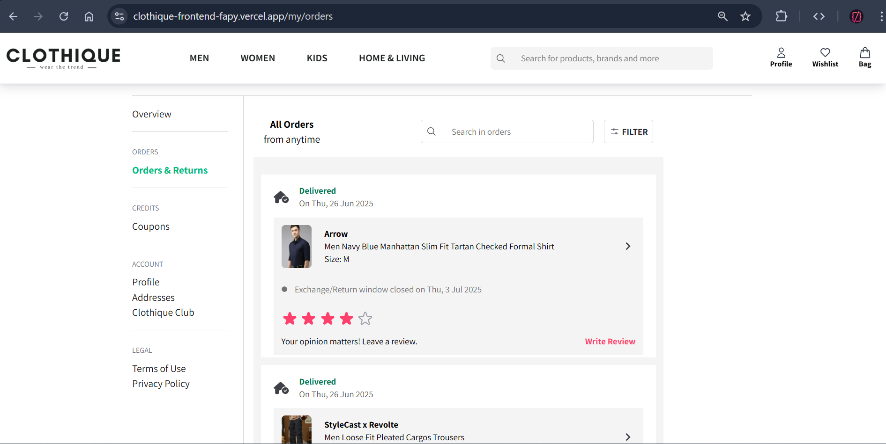
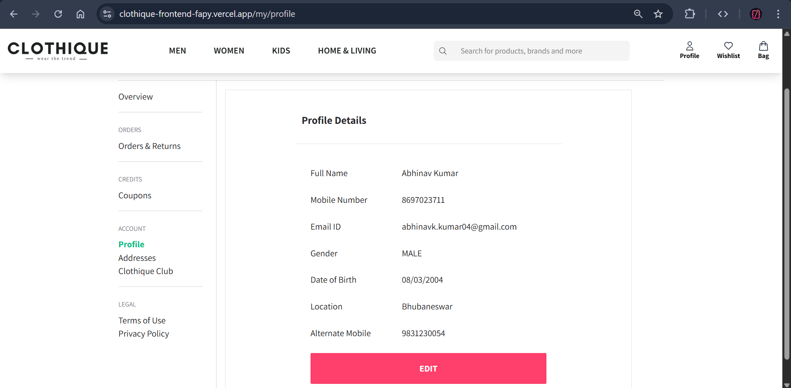
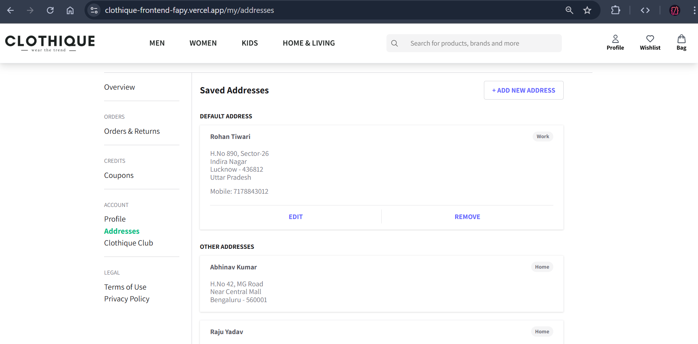

# CLOTHIQUE

🚀 [Live Demo](https://clothique-frontend-fapy.vercel.app/)

Clothique is a modern, sleek, and responsive e-commerce platform built from scratch to simulate a real-world online fashion store experience. From intelligent search to seamless cart handling, it's designed to **impress, convert, and retain**.

---

## 🛠️ Tech Stack

- **Frontend:** React.js, Tailwind CSS, React Router, Context API
- **Backend:** Node.js, Express.js, MongoDB, Mongoose
- **Authentication:** JWT
- **Hosting:** Vercel (Frontend), Render (Backend)

---

## ✨ Key Features

- 🔍 **Intelligent Search with Filters & Sort:** Type anything like "t-shirts for men" and get live results with filtering by size, price, category, and sort by popularity or recency.
- 📄 **Product Details View:** Check every detail—price, sizes available, delivery estimate, specifications and full description.
- 🧺 **Smart Cart Management:** Add/edit/remove items and adjust sizes/quantities dynamically.
- ❤️ **Wishlist Management:** Save products you love to revisit later.
- 📍 **Address Book:** Add, edit, and delete multiple delivery addresses.
- 🔐 **OTP-based Secure Login:** Login quickly with your mobile number—no passwords.
- 👤 **User Profile:** Maintain and update your personal information anytime.
- 🧾 **Order History:** View all your past orders with timestamps and product details.
- ✅ **Responsive Design:** Fully optimized for mobile and desktop experiences.

---

## 📸 Screenshots

| Search Page                              | Product Results                            |
| ---------------------------------------- | ------------------------------------------ |
|  |  |

| Cart                                 | Checkout                                               |
| ------------------------------------ | ------------------------------------------------------ |
|  |  |

| Wishlist                                     | Orders                                   |
| -------------------------------------------- | ---------------------------------------- |
|  |  |

| Profile                                    | Saved Addresses                                   |
| ------------------------------------------ | ------------------------------------------------- |
|  |  |

_(More screenshots in the `assets/screenshots` folder)_

---

## 🙌 Contributions

Built with ❤️ by Abhinav Kumar

---
